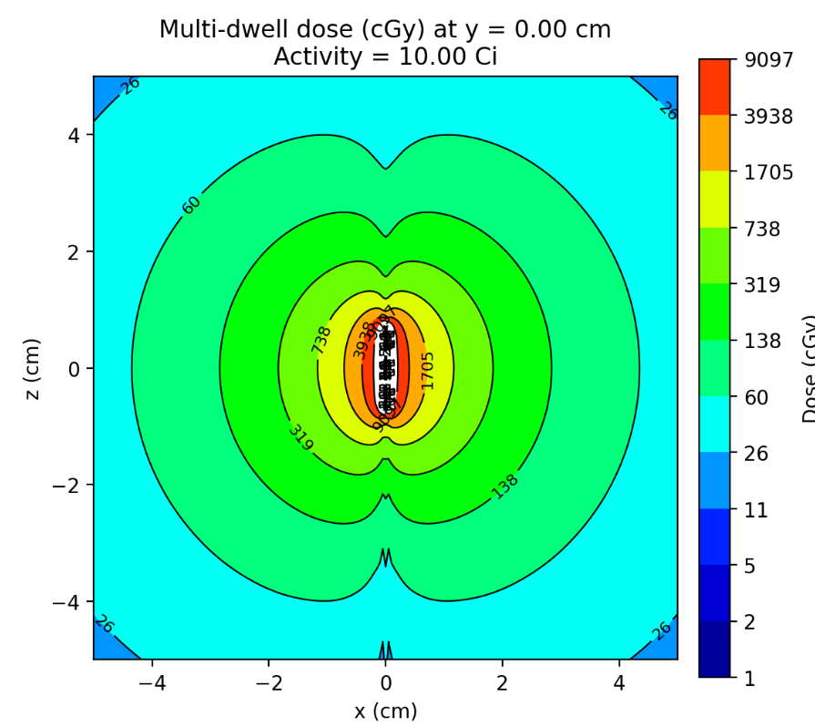

# TG-43 Ir-192 HDR Dose Calculation Tool (v0.1.0)

## 🧭 Overview

A lightweight Streamlit app implementing the **TG-43(U1)** formalism for the **Varian VS2000 Ir-192 HDR source**, designed for teaching, research, independent verification / secondary checks, QA method development, etc.

---

## ⚡ Features

- **TG-43(U1) dose engine**  
  - Geometry factor, radial dose function, anisotropy, dose-rate constant  
  - Multi-dwell summation  
- **Interactive UI (Streamlit)**  
  - Editable dwell table (x, y, z, time)  
  - Adjustable source activity  
  - Real-time dose updates  
- **Point-dose calculator** for any (x, y, z)  
- **2D isodose plots** (absolute & relative)



---

## 🚀 Quick Start

```bash
git clone https://github.com/afiosman/TG43-app
cd TG43-app
pip install -r requirements.txt
streamlit run app.py
```

---

## ⚠️ Disclaimer

This software is provided for educational, research, and prototyping purposes only.
It has not been clinically commissioned or validated and must not be used for patient treatment planning or clinical decision making.

---

## 📜 Citation

If you use this tool in research, teaching, or publications, please cite:

> Osman, A. F. I. (2025). *TG-43 Ir-192 HDR Dose Calculation Tool (v0.1.0)*. https://github.com/afiosman

---

## 📬 Contact

For questions, suggestions, or bug reports, please contact:

**Alexander F. I. Osman**  
PhD Student, Department of Radiation Oncology  
Virginia Commonwealth University  

📧 **Email:** alexanderfadul@yahoo.com  

---

## 🟡 License

[MIT License](https://opensource.org/licenses/MIT)

---
